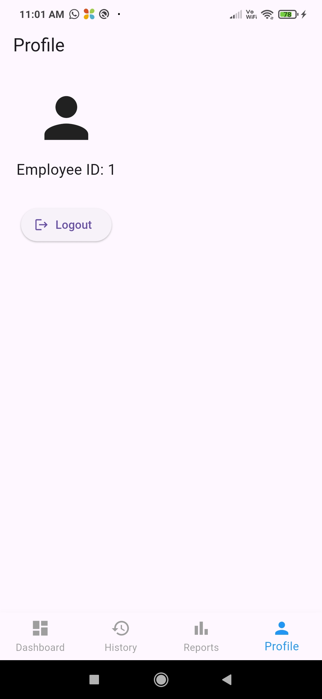
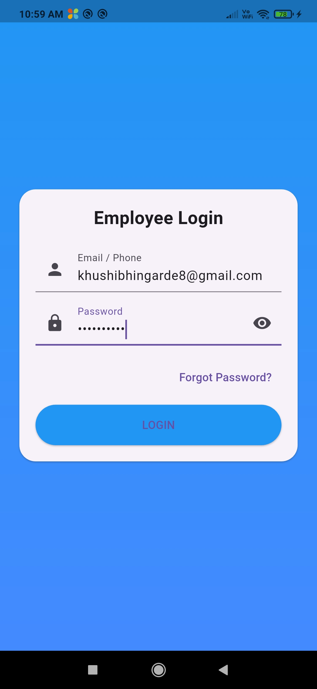

# Geo-Fence Employee Attendance System

A full-stack employee attendance management system using geofencing, real-time location tracking, automated attendance processing, and a Flutter mobile application.

## Features

- Employee check-in and check-out
- GPS-based geofencing
- Real-time employee location tracking
- Automatic absent marking
- Automatic attendance status calculation
- Late arrival tracking
- Leave management
- Monthly attendance reports
- Admin dashboard
- Employee management
- Push notifications
- Flutter mobile application
- Secure employee authentication
- Password change and forgot-password functionality

## Technologies Used

### Backend
- Python
- Flask
- MySQL
- APScheduler
- Firebase

### Frontend
- HTML
- CSS
- JavaScript

### Mobile Application
- Flutter
- Dart
- Google Maps
- Firebase Cloud Messaging
- Geolocator

## Project Structure

```text
Geo-Fence-Attendance-System/
│
├── routes/
├── templates/
├── static/
├── mobile app/
├── app.py
├── config.py
├── database.py
├── scheduler.py
└── README.md

## Screenshots

### System Workflow


### Admin Dashboard


### Live Map for Admin


### Employee Dashboard


### Attendance History


### Monthly Report


### Leave Dashboard


### Leave Application


### Employee Tracking


### Employee Tracking Alerts


### Notifications


### Profile


### Login
